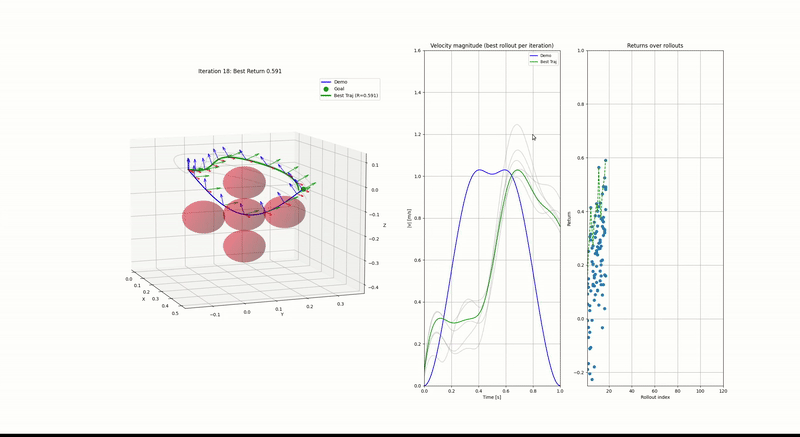
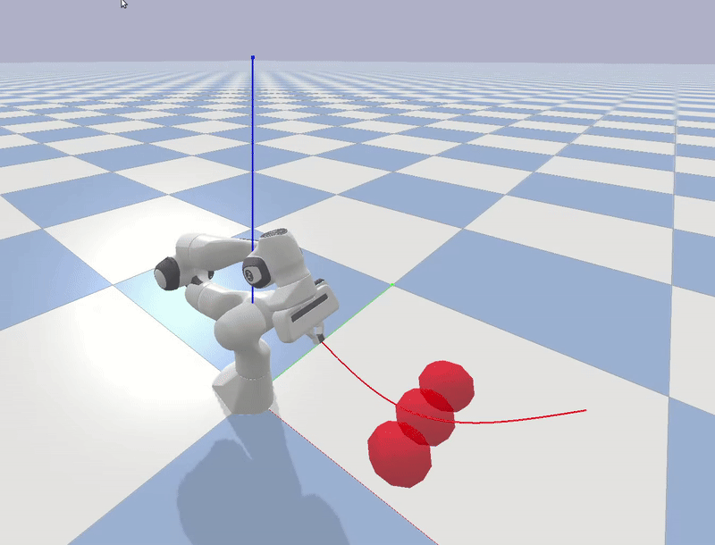
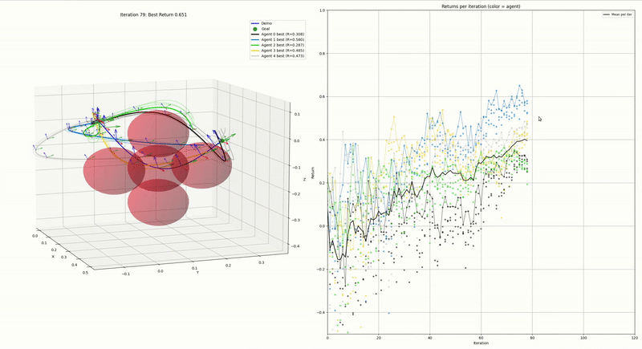
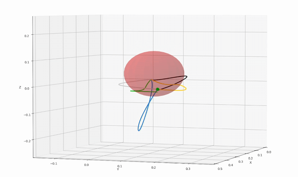
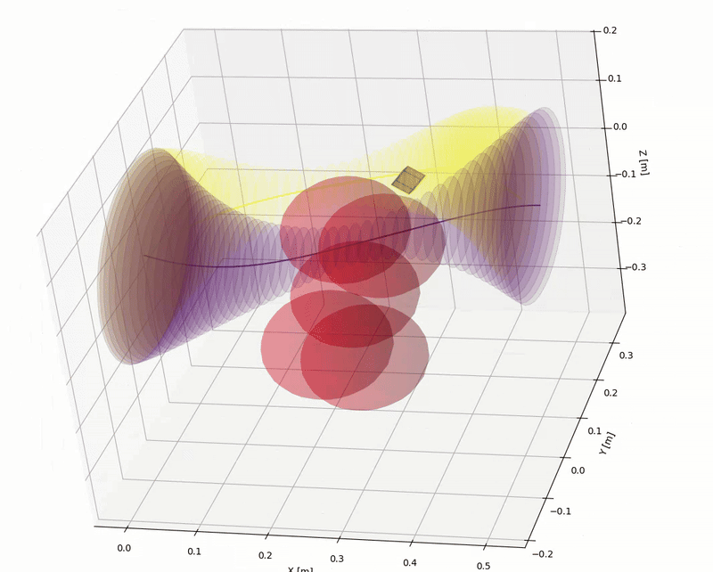

# 🤖 RL, DMP and LMPC for Robotic Manipulators

[](https://www.python.org/)
[](https://pypi.org/)
[](LICENSE)

This project demonstrates **Reinforcement learning (RL) and Dynamic Movement Primitives (DMP)** coupled with **Linear Model Predictive Control (LMPC) and Quadratic Programming** for robotic manipulators.  
- **RL** is used to find a 6D path while doing obstacle avoidance (just the end-effector)
- **LMPC+QP** solves Inverse Kinematics (IK) with constraints such as joint limits and ensuring that the whole robot body (not just the end-effector) avoids obstacles
The repo include a demo to generate a trajectory (with live animations) which is saved and then replayed on the robot using pybullet and the LMPC controller.

The Reinforcement Learning formulation is based on:
> Petar Kormushev, Sylvain Calinon and Darwin G. Caldwell  
> ["Robot Motor Skill Coordination with EM-based Reinforcement Learning."](https://www.researchgate.net/publication/224199135_Robot_Motor_Skill_Coordination_with_EM-based_Reinforcement_Learning) (2010)
Is it implemented with numba for fast computation.

The LMPC problem formulation is based on:  
> Alberto, Nicolas Torres, et al.  
> ["Linear Model Predictive Control in SE(3) for online trajectory planning in dynamic workspaces."](https://hal.science/hal-03790059/document) (2022)

---
A more detailed repository for the LMPC formulation can be found at: https://github.com/fleurssauvages/LMPC_for_Manipulators

## ⚡ Installation

Clone the repository and install the required dependencies:

```bash
pip install roboticstoolbox-python numpy qpsolvers
```

For the plot:

```bash
pip install matplotlib pickle
```

For the simulation:

```bash
pip install pybullet
```

---

## 🚀 Run the Simulations

- **Reinforcement learning with Dynamic Movement Primitives**  
  ```bash
  python demo_simple_6D.py
  ```
  RL based on a demo to perform reaching with obstacle avoidance. The trajectory is then resampled for better velocity curvature and saved with pickle.

- **Replaying in Pybullet**  
  ```bash
  python replay_pybullet.py
  ```
  The trajectory is then played on the robot, using an LMPC and QP controller. Multiple points of the robot effector (here a Franka, which has a large gripper) and computed during the obstacle avoidance by considering obstacles as spheres. The output velocity projected on their tangent planes are then computed to force avoidance of the whole gripper, not just the cartesian point considered during RL.

- **Multi Agent RL and DMP**  
  ```bash
  python demo_multiagent_6D.py
  ```
  The RL is extended as a demonstration to multiple agents, with repulsion to increase diversity and strategies to different part of the explorable space.

- **Multi Replay**  
  ```bash
  python replay_pybullet_multi.py
  ```
  Each trajectory is replayed succesively. Note: this could be use to evaluate which trajectories are actually replayable with the full robot model and controller.

- **Multi Agent RL with moving obstacle**  
```bash
python demo_moving_object.py
```
The obstacle is moving as a sinus. The exploration is rescaled depending on the object's motion, to fine a new trajectory. The goal is to get a form of temporal consistency.

- **Example coupled with Space Mouse Joystick: hard constraint**  
```bash
python path_constrained_demo.py
```
Generate acceptables zones as "tubes" around the previously exported trajectories. These tubes can be used to then control a 6D desired position with hard limits, for example in this example with a 6D Space Mouse. The same script is also implemented with Pybullet and the full robot model.

  - **Example coupled with Space Mouse Joystick: flowed control**  
```bash
python flow_controlled_demo.py
```
How top of the previous hard constraints, when the joystick is active and the radius is small (i.e we are close to obstacles) we pull the position towards the closest trajectory. The same script is also implemented with Pybullet and the full robot model.
---

## 📂 Project Structure

```
├── images/                         # Demo GIFs
├── MPC/                            # Contains the LMPC and QP
├── scripts/
│   ├── demo_utils.py               # utils for generating and plotting for the RL demo
│   ├── env_reaching.py             # Environnement for DMP simulation
│   ├── power_rl.py                 # Power RL from Kober
│   ├── multiagent_power_rl.py      # Extended to multiple agents with repulsion for diversity
│   ├── dmp.py                      # DMP class
│   ├── resample.py                 # utils for resampling trajectories
├── demo_simple_6D.py               # Reinforcement learning demo
├── demo_multiagent_6D.py           # Extension with multiple agents
├── demo_moving_object.py           # Extension with an obstacle that is moving as a sinus
├── replay_pybullet.py              # Replay trajectory on robot
├── replay_pybullet_multi.py        # Replay multiple trajectory on robot successively
├── path_constrained_demo.py        # Tube constraints for user controlled position with a Space Mouse Joystick
├── path_constrained_pybullet.py    # Same in Pybullet
├── flow_controlled_demo.py         # Adds a flow to the tube constrained, plot in Matplotlib
├── flow_controlled_pybullet.py     # Same in Pybullet
├── README.md                       # Project documentation
└── LICENSE                         # License file
```

---

## 🎥 Demos

<div align="center">

### 🔹 Reinforcement learning for path finding


---

### 🔹 Pybullet replaying with LMPC controller


---

### 🔹 Multi Agent RL


---

### 🔹 Multi Agent RL with moving object


---


### 🔹 Hard Tube Constrainsts with User Joystick Input


---

### 🔹 Flow control, a force pulls the user towards the trajectory when the tube radius is small (Pybullet)

---

</div>

---

## 📜 License
This project is licensed under the [MIT License](LICENSE).  

---

## ⭐ Acknowledgments
- Inspired by the work of Alberto, Nicolas Torres, et al. (2022).
- Inspired by the work of Petar Kormushev, Sylvain Calinon and Darwin G. Caldwell (2010)